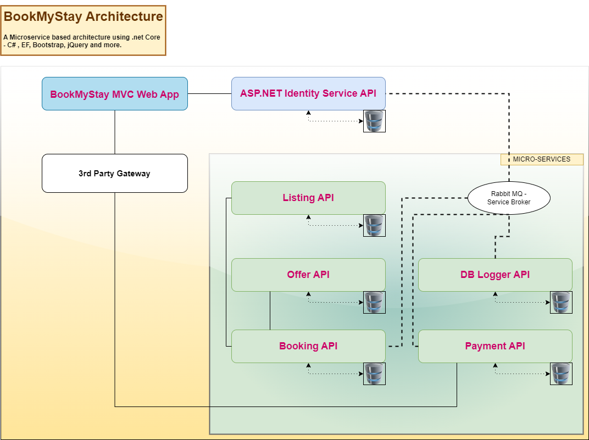

# BookMyStay

## A Microservice Architecture For Real World Scenario

---
Main (Micro) Services:

* Authentication Service - Secure API Endpoints Using Microsoft Identity Services And Custom JWT Token Management
* Listing Service - Lists/Manages all popular stays
* Offers Service - Lists/Manages available offers
* Bookings Service - Manages bookings made by end users
* Order Service - Manages the orders placed by end users
* Message Broker - Manages the cross-service communication {Using RabbitMQ - Future plan to update to Azure Service Bus)
* DB Logger - Consume the specific messages from RabbitMQ and store it for further reporting)

Main Features
- Latest .Net Core 8, Compatible across multiple OS and systems
- Clean Architecture and .Net core best practices implemented
- Listing and CRUD operations, Managed using dedicated SQL server instances, per service.
- Secured end-points using Microsoft Identity Services.
- Implement payment gateway - Stripe API or equivalent
- Intuitive UI, Clean Bootstrap 5 based simple UI for easy customization

WIP/Todos
- Booking Scheduling - At present the bookings are just simple order placement, without date range specified.
- Message Broker is to be updated - plans to change to Azure Service Bus 

## Architecturual Overview

